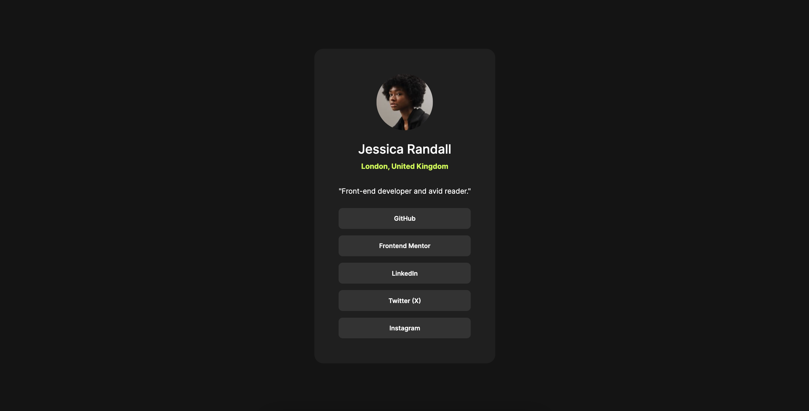
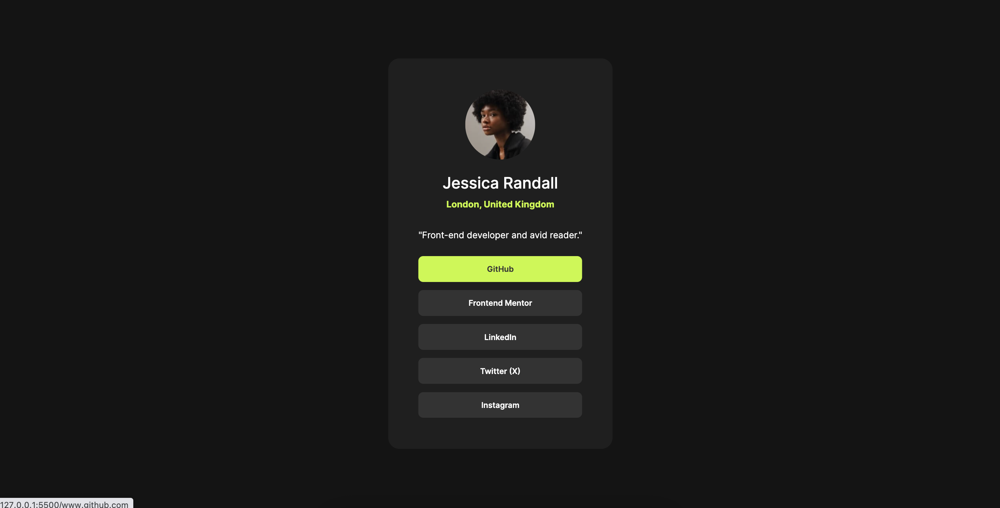
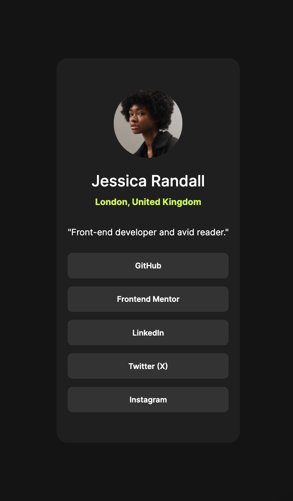

# 🪪 Frontend Mentor - Social Links Profile Solution

This is a solution to the <a href="https://www.frontendmentor.io/challenges/social-links-profile-UG32l9m6dQ" target="_blank">[Social Links Profile on Frontend Mentor]</a>.

# 📸 Screenshot
<table>
  <thead>
    <th>Web Version</th>
    <th>Active State</th>
    <th>Mobile Version</th>
  </thead>
  <tbody>
    <tr>
      <td></td>
      <td></td>
      <td></td>
    </tr>
  </tbody>
</table>

# 🔗 Links
<ul>
  <li><strong>Solution URL:</strong> github.com/itsadnwn/social-links-profile</li>
  <li><strong>Live Site URL:</strong> itsadnwn-social-links-profile.vercel.app/</li>
</ul>

# 📂 Technologies

This project was built with:

<ul>
  <li><strong>HTML:</strong> Markup language for creating the content and structure</li>
  <li><strong>CSS:</strong> For styling both web and mobile version</li>
</ul>

# 🖱️ Interaction

Resize your browser (in terms of width) to see the mobile version.

# 🗒️ Project Structure

Here are the key files and their purposes:

<ul>
  <li><strong>index.html:</strong> The main HTML file that contains the structure and content of the Social Links Profile page.</li>
  <li><strong>style.css:</strong> The CSS file that styles the page.</li>
</ul>
